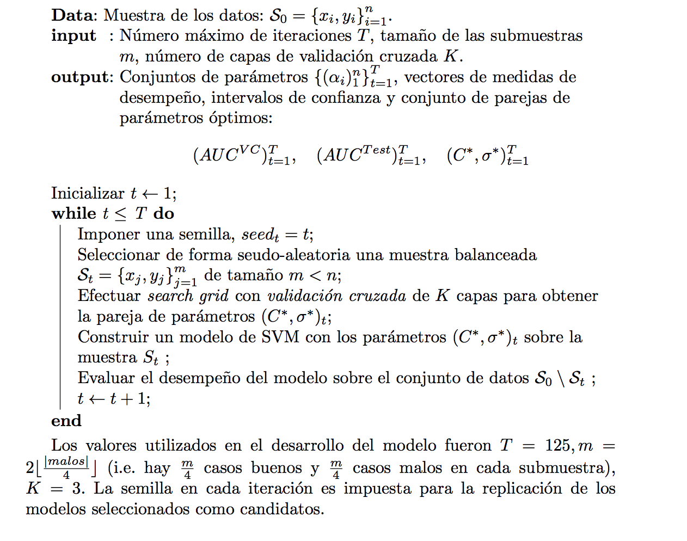

```{r,echo=FALSE,eval=TRUE,warning=FALSE,message=FALSE}
 load("global_pf_sponda.RData")
```
# Intoducción

El motivo de este proyecto consiste en desarrollar un modelo que permita ser más efectivos en los tiempos de respuesta a los clientes al momento de solicitar un crédito, así como diferenciar a aquellos clientes que representan un negocio rentable para el banco de aquellos que podrían tener una calidad crediticia inferior. 

Para ello se ha utilizado información histórica de clientes junto con su respectiva información que proviene del buró de crédito. Entre ellas encontramos características personales del cliente, así como los scores que realiza el buró de crédito, además de patrones de comportamiento de las formas de pago de los clientes en cada una de sus cuentas abiertas y cerradas de su línea de crédito.

# Metodología

Para realizar dicha tarea, se propone ajustar dos modelos de aprendizaje de máquina. El primero de ellos, bien conocido por el negocio, es la regresión logística, el segundo de ellos son las máquinas de soporte vectorial. Estas últimas han demostrado tener en algunos casos un mejor desempeño que la regresión logistica y cada vez mayor aceptación en el mercado. Así pues, es de nuestro interés comparar ambos modelos con la finalidad de implantar aquel que nos proporcine mayor capacidad de discriminación.

El primer modelo que se propone ajustar debido a su complejidad son las máquinas de soporte vectorial (SVM por sus siglas en inglés). Las máquinas de soporte vectorial (SVM) son un conjunto de métodos utilizados en el Aprendizaje Estadístico para modelar problemas de clasificación y de regresión. En su formulación más tradicional para problemas de clasificación, dado un conjunto de observaciones en donde cada una pertenece a una de dos clases, el método de SVM construye un modelo que asigna nuevas observaciones a alguna de las dos clases. Además de utilizarse para clasificación lineal, el método puede ser utilizado para realizar clasificación no lineal mediante el truco del Kernel. El método, gracias a su gran flexibilidad, es ampliamente utilizado en aplicaciones de Inteligencia Artificial, especialmente en Computer Vision, Speech Recognition y Text Categorization. Debido a su formulación y a sus propiedades, es posible construir un score para riesgo de crédito, además de dar una interpretación en términos de la similitud entre los clientes evaluados.

## Muestras de desarrollo y validación

El conjunto de datos se divide en una muestra de entrenamiento y una muestra de prueba. Para esto, se realizó muestreo estratificado para conservar las tasas de incumplimiento muy similares entre las muestras de entrenamiento y prueba. Se efectuó una partición en donde 80% de las observaciones forman parte de la muestra de entrenamiento (o de desarrollo) y el restante 20% de la muestra de prueba (o de validación).

## Variables

Como se ha mencionado anteriormente, las variables utilizadas en este modelo forman parte de dos grandes grupos. El primero de ellos corresponde a las características del cliente, tales como edad, antiguedad como cliente, antigüedad en su hogar, cuántas personas dependen de él, escolaridad, etc. El segundo grupo corresponde a las características del cliente desde un punto de vista financiero, como pueden ser el número de créditos vigentes, los scores de buró, el saldo máximo actual, el saldo máximo vencido, entre otras. De este conjunto de variables se ha seleccionado un conjunto más reducido y a doc para el universo de entrenamiento que se tiene, a partir del cálculo del gini para cada variable quedándonos con aquellas que tienen un gini mayor. En total se cuenta con un universo de $109,034$ datos con $23$ variables.

## Selección de Modelos y Validación

## Balanceo de clases

La proporción real en la muestra total de los casos etiquetados como malos es baja. Dado que se desea que el modelo sea capaz de discriminar especialmente a los casos malos, se ha decidido realizar un balanceo de las clases, de modo que la proporción sea de 1:1. Sin embargo, se desea que la Probabilidad de Default refleje la proporción real de los casos malos y los casos buenos del universo de clientes para los que se realizó la modelización, por lo que se ha seguido el siguiente enfoque.

* Obtener un modelo de SVM a partir de una muestra balanceada de los datos, de modo que se obtenga un score que proporcione un ordenamiento a las observaciones.

Definimos los siguientes conjuntos. Los datos de entrenamiento están dados por el conjunto

$$ S= \left \{x_i,y_i\right \}_{i=1}^n, \quad x_i \in X, y_i \in Y $$

en donde $X$ es el espacio de las características de los clientes y $$ Y = \left \{ -1, 1 \right \}$$  representa la etiqueta de clase de los clientes, mientras que los conjuntos de clientes buenos y malos se definen como

$$ buenos=\left \{(x_i,y_i) \in S \mid y_i=-1\right \} $$

$$ malos=\left \{(x_i,y_i) \in S \mid y_i=1\right \} $$

### Selección de Kernel y Parámetros

En la formulación del método SVM, se tiene un parámetro $C$ cuyo objetivo es controlar el tradeoff que existe entre el tamaño del margen y el número de violaciones a las restricciones del margen. Por otra parte, dependiendo de la función Kernel utilizada, se tiene otro conjunto de parámetros que han de seleccionarse. En esta aplicación, se ha decidido utilizar el Kernel Radial debido a que es fácilmente intrpretable en términos de similitud ya que ha mostrado ser de los más eficientes en términos de predicción en numerosas aplicaciones en otros campos. Este Kernel contiene sólo un parámetro (el parámetro $\sigma$) por seleccionar. De este modo, la selección (o calibración) de los parámetros se restringe a una búsqueda en dos dimensiones para la pareja de parámetros $(C, \sigma)$. Esta búsqueda se ha realizado de una forma tradicional, combinando las estretegias de search grid y validación cruzada de modo que se elige la pareja de parámetros en donde el AUC es máximo y el número de vectores de soporte sea balanceado.
La búsqueda de los parámetros se realizó sobre el siguiente conjunto, el cual fue determinado después de realizar pruebas sobre diversos conjuntos y refinamientos del grid:

$$(C,\sigma) \in \left \{1,10,100\right \} X \left \{0.1,0.3,0.5,1,10,100\right \}= P $$

de forma que $\mid P \mid =18$.

## Selección del modelo

Dado el bajo número de casos etiquetados como malos y al balanceo de la proporción de las clases que se desea realizar, es necesario seguir una estrategia de remuestreo de forma repetitiva un número suficientemente grande de veces. Esto es porque con solo una muestra de los datos disponibles se obtendría un modelo sobreajustado. Debe notarse que, a diferencia de otros métodos clásicos como la regresión logística, el método SVM es un método basado en casos (instance-based learning). En el método SVM, el conjunto de parámetros que se obtiene corresponde a las observaciones y no a las variables con las que se cuenta; por lo tanto no se puede hablar de encontrar un promedio de los parámetros del modelo a través de remuestreo de forma repetitiva. De este modo, al seguir el enfoque de remuestreo con clases balanceadas, el problema se traduce en encontrar el mejor conjunto de parámetros (i.e. el mejor conjunto de vectores de soporte y sus coeficientes), en términos de poder de predicción.


La idea de la estrategia es la siguiente. En cada iteración, seleccionar una muestra reducida y balanceada de casos buenos y malos. Para esta muestra, obtener un modelo de SVM, habiendo elegido los parámetros mediante search grid y validación cruzada. Para este modelo, obtener una medida de desempeño honesta (el AUC o el Gini) sobre una muestra independiente cuya proporción de casos buenos y malos sea muy similar a la real (la muestra original exceptuando los casos que se utilizaron para obtener el modelo). De esta forma, repetir este procedimiento un numero suficiente de veces de modo que se pueda elegir un modelo cuyo desempeño sea suficientemente bueno (relativo al promedio del desempeño sobre todas las iteraciones) en muestras de entrenamiento y de validación.

Más concretamente, el procedimiento realizado se ilustra en el siguiente pseudocódigo.



## Interpretación del Score

La función de predicción (el score) del modelo con el Kernel radial utilizado
es

$$ f(x)=\sum_{i \in SV} \alpha_i y_i e^{-\gamma \left \| x-x_i \right \|^2} +b $$ 


En el contexto de esta aplicación, las observaciones $x_i$ representan clientes cuyas variables provienen de información interna como del Buró de crédito.

Para obtener el score de un nuevo cliente, los valores de sus variables son comparados con los de otros clientes (los que corresponden a los vectores de soporte), clasificados previamente como solventes o insolventes. Se puede decir que el score es obtenido como una suma ponderada de medidas de similitud entre un nuevo cliente y un subconjunto de los clientes utilizados en el desarrollo, los cuales se sabe previamente son solventes o insolventes. Por lo tanto, el score de un cliente depende de con qué grupo tiene mayor similitud, y a qué grado. Para ilustrar esta idea, supóngase que se tiene un conjunto de clientes buenos y malos y que el modelo solo depende de dos variables. Supóngase también que el problema es linealmente separable en estas dos variables. Por lo tanto, la recta que separa ambas clases ( la función de clasificación ) es elscore y los vectores de soporte, corresponden a observaciones de las cuales depende el score; de tal manera que el cálculo del score para un nuevo cliente $x$ puede ser explicado como 


$$ score(x)=\sum_{i=1}^{malos \in SV}\alpha_i similitud(malo_i,x) + \sum_{j=1}^{buenos \in SV}\beta_j similitud(bueno_j,x)  $$

donde los parámetros $\alpha_i$ y $\beta_j$ son las ponderaciones correspondientes a los clientes malos y buenos respectivamente, y los cuales son encontrados mediante el método. Este mismo razonamiento puede ser extrapolado al caso en donde se realiza el mapeo implícito de las observaciones mediante un Kernel, de modo que la separación lineal tome lugar en un espacio de mayor dimensión.


##  Regresión Logística


El segundo método que se probará para este desarrollo es la regresión logística, el cuál ocupa un papel muy importante en el ámbito bancario debido a su efectividad y fácil interpretabilidad. Este modelo se ha convertido en el benchmark para cualquier proyecto.

Debemos recordar que en este caso en particular, lo que se desea es ordentar a la población de tal manera que se logre discriminar a aquellos clientes que son estables en términos crediticios de aquellos que no. Por lo tanto, se define el indicador de incumplimiento como variable dependiente y como variables independentes, las variables que resultaron tener buen poder predictivo en el modelo de svm, esto es con la finalidad de que la comparación entre los modelos sea justa. Por otra parte, se siguió una estrategia de modelado estándar: construir el modelo a partir de la base de entrenamiento y probar su desempeño en la base de prueba.


# Resultados

## Resultados Modelo SVM

En este apartado se presenta un resumen de los modelos obtenidos. Se presentan los parámetros de la función de decisión, así como las estimaciones del desempeño de los modelos.

Parámetros del modelo SVM

$$C=1, \quad \sigma=0.1 \quad b=0.1106492 \quad \mid SV \mid=490 $$

Las estimaciones del desempeño del modelo son:

$$AUC^{VC}=0.8377 \quad AUC^{Test}=0.8283   $$

```{r,echo=FALSE,eval=TRUE,warning=FALSE,message=FALSE}
library(pROC)
rocobj<-plot.roc(seg4test_full$inc, seg4test_full$preds,percent=TRUE, ci=TRUE,print.auc=TRUE) 
```

## Resultados Modelo Regresión Logística

Los resultados obtenidos son los siguientes:

La estimación del desempeño por validación cruzada y en muestra de prueba está dado por:

$$ AUC^{CV}=0.7793 \quad AUC^{Test}=0.7861 $$

```{r,echo=FALSE,eval=TRUE,warning=FALSE,message=FALSE}
library(pROC)
roccurve<-plot.roc(seg4_test$Y2, seg4_test$pd_reglog,
                   percent=TRUE, ci=TRUE,print.auc=TRUE)
```


# Conclusiones

El material presentado en este documento ilustra cómo el método SVM se ha utilizado para construir una función score para discriminar clientes solventes e insolventes. Se ha discutido cómo el score puede ser interpretado en términos de similitud de las características de los clientes evaluados. Adicionalmente se ha dado evidencia que para este caso en particular el desempeño del modelo de SVM es superior a la metodología tradicional de regresión logística, por lo que esto podría sugerir que el mercado debe estar abierto a nuevos métodos estadísticos, pues al final del camino, se traduce en ganancias de diferentes tipos para el sector financiero. En particular, el método de máquinas de soporte vectorial a pesar de tener un fundamento teórico muy elevado, el hecho de  que se busca hacer una comparación entre observaciones (clientes) e identificar aquellos que te ayudan a discriminar mejor a la población, parece ser un concepto fácil de asimilar para aquellas personas que no tiene bases técnicas en su desarrollo profesional. 

Aunque el proceso computacional para ajustar la máquina de soporte vectorial fue muy costoso, queda a consideración del lector, intentar implementar una versión paralelizable de tal manera que los tiempos y esfuerzo a nivel máquina decrezcan.

# Código 

```{r,echo=TRUE,eval=FALSE,warning=FALSE,message=FALSE}


sampling<-function(base,T){
  
  library(mlr)
  library(kernlab)
  library(ROCR)
  #library(pROC)
  ################################
  #Argumentos para la funcion MLR
  learner = makeLearner("classif.ksvm",predict.type="prob")
  # SE DEFINE EL CONJUNTO DE VALORES PARA FORMAR EL GRID
  param= makeParamSet( 
    makeDiscreteParam("C", values = c(1)), 
    makeDiscreteParam("sigma", values = c(.1))
  )
  ctrl = makeTuneControlGrid()
  inner = makeResampleDesc("Holdout")       #Holdout validation  
  outer = makeResampleDesc("CV", iters = 3) #K-fold CrossValidation
  
  ################################
  malos<-subset(base,inc==1)   #Subset con clientes con incumplimiento igual a 1
  num_malos<-nrow(malos)
  buenos<-subset(base,inc==0)  #Subset con clientes con incumplimiento igual a 0
  
  #En estos vectores vamos a guardar los mejores AUC por VC, los mejores parametros C
  #y sigma en cada iteracion y el AUC con muestra de prueba
  aucs<-rep(0,T)
  Cs<-rep(0,T)
  sigmas<-rep(0,T)
  aucs_train<-rep(0,T)
  ci_lower<-rep(0,T)
  ci_upper<-rep(0,T)
  nsv<-rep(0,T) #Numero de SV
  tprs<-rep(0,T)
  accs<-rep(0,T)
  
  #Loop:
  # Hacemos T iteraciones. COnservamos los malos
  for (i in 1:T){
    library(mlr)
    set.seed(i)
    
    ind_samp<-sample(1:nrow(buenos), size=floor(num_malos/4), replace = FALSE, prob = NULL)
    ind_malos<-sample(1:nrow(malos),size=floor(num_malos/4),replace=FALSE,prob=NULL)
    
    samp<-buenos[ind_samp,]
    samp_malos<-malos[ind_malos,]
    samp_complemento<-buenos[-ind_samp,]
    samp_malos_complemento<-malos[-ind_malos,]
    base_complemento<-rbind(samp_complemento,samp_malos_complemento)
    
    basesamp<-rbind(samp,samp_malos)
    sub.base<-basesamp
    
    sub.base$inc<-as.factor(sub.base$inc)
    task<-makeClassifTask(data=sub.base, target="inc")
    lrnr_task = makeTuneWrapper(learner, resampling = outer, par.set = param, 
                                control = ctrl, measure=list(auc,tpr,fpr,acc))
    set.seed(i)
    mod = train(lrnr_task, task)
    
    aucs[i]<-mod$learner.model$opt.result$y[1]
    tprs[i]<-mod$learner.model$opt.result$y[2]
    accs[i]<-mod$learner.model$opt.result$y[4]
    Cs[i]<-mod$learner.model$opt.result$x[[1]]
    sigmas[i]<-mod$learner.model$opt.result$x[[2]]
    
    
    
    model<-ksvm(inc~., data=sub.base, type = "C-svc", C=mod$learner.model$opt.result$x[[1]],
                kpar=list(sigma = mod$learner.model$opt.result$x[[2]]),prob.model=T)  
    nsv[i]<-model@nSV
    
    set.seed(i)
    
    preds_train<-predict(model,newdata=base_complemento,type="probabilities")
    preds_train<-preds_train[,2]
    base_complemento$preds<-preds_train
    
    library(pROC)
    rocobj<-plot.roc(base_complemento$inc, base_complemento$preds,percent=TRUE, 
                     ci=TRUE,print.auc=TRUE) 
    aucs_train[i]<-rocobj$auc
    
    detach("package:pROC",unload=T)
    detach("package:mlr",unload=T)
    
  }
  #Guardamos los vectores de los resultados en una lista y retornamos ese objeto
  list_result<-list(aucs,Cs,sigmas,aucs_train,tprs,accs,nsv)                                           
  return(list_result)
}

################################################################################
# Maquinas de Soporte Vectorial
################################################################################

clientes_bm<-desarrollo_base_train[1:43280,]
clientes_nobm<-desarrollo_base_train[43281:87228,]

clientes_nobm_malos<-subset(clientes_nobm,Y2==1)

base_new<-rbind(clientes_bm,clientes_nobm_malos)

base_llaves_new<-base_new$llavepu
base_new$llavepu<-NULL
base_new$train<-NULL
base_new$MODELO<-NULL
base_new$cosecha<-NULL

base_new$inc<-base_new$Y2
base_new$Y2<-NULL

result_new<-sampling(base_new,125)

df<-as.data.frame(cbind(result_new[[1]],result_new[[2]],result_new[[3]],
                        result_new[[4]],result_new[[5]],result_new[[6]],
                        result_new[[7]]))

names(df)<-c("AUC_CV","C","sigma","AUC_Test","TPR","ACC","Nsv")

write.csv(df,"result_base.csv")


################################################################################
# Mejor modelo de máquinas de soporte vectorial
################################################################################
#Replicando mejor modelo
base_new$preds<-NULL

base_new$llavepu<-base_llaves_new

bestiter_s4<-102
set.seed(bestiter_s4)
base<-base_new

malos<-subset(base,inc==1)   #Subset con clientes con incumplimiento igual a 1
num_malos<-nrow(malos)
buenos<-subset(base,inc==0) 

ind_samp<-sample(1:nrow(buenos), size=floor(num_malos/4), replace = FALSE, prob = NULL)
ind_malos<-sample(1:nrow(malos),size=floor(num_malos/4),replace=FALSE,prob=NULL)

samp<-buenos[ind_samp,]
samp_malos<-malos[ind_malos,]
samp_complemento<-buenos[-ind_samp,]
samp_malos_complemento<-malos[-ind_malos,]
base_complemento<-rbind(samp_complemento,samp_malos_complemento)

basesamp<-rbind(samp,samp_malos)
sub.base<-basesamp
sub.base$inc<-as.factor(sub.base$inc)

base_llaves_train<-sub.base$llavepu
sub.base$llavepu<-NULL

model<-ksvm(inc~., data=sub.base, type = "C-svc", C=df[bestiter_s4,2],kpar=list(sigma = df[bestiter_s4,3]),prob.model=T)  


#######################
#BASE DE ENTRENAMIENTO#
#######################

preds_train<-predict(model,newdata=sub.base,type="probabilities")
preds_train<-preds_train[,2]
sub.base$preds<-preds_train

library(pROC)
rocobj<-plot.roc(sub.base$inc, sub.base$preds,percent=TRUE, ci=TRUE,print.auc=TRUE) 
rocobj$auc 
#91.43

######################
#BASE DE PRUEBA INDEP#
######################

basetest<-desarrollo_base_test

basetest$inc<-basetest$Y2
basetest$Y2<-NULL

basetest<-na.omit(basetest)

base_llaves_test<-basetest$llavepu
basetest$llavepu<-NULL
basetest$cosecha<-NULL
basetest$MODELO<-NULL
basetest$train<-NULL
basetest$llavepu<-base_llaves_test

#############################
# TRAIN NO UTILIZADA + TEST #
#############################

#68740 observaciones
basetest_full<-rbind(base_complemento,basetest)

preds_test<-predict(model,newdata=basetest_full,type="probabilities")
preds_test<-preds_test[,2]
basetest_full$preds<-preds_test

library(pROC)
rocobj<-plot.roc(basetest_full$inc, basetest_full$preds,percent=TRUE, ci=TRUE,print.auc=TRUE) 
rocobj$auc 
#82.83


###################################
# GUARDANDO BASE DE ENTRENAMIENTO #
###################################

sub.base$llavepu<-base_llaves_train
write.csv(sub.base,"base_subbase.csv")

write.csv(basetest_full,"base_testfull.csv")


########################################################################
# REGRESIONES LOGISTICAS: 
# Se ajustan regresiones logisticas para comparar el desempe~no con los
# modelos obtenidos mediante SVM
########################################################################

base_train<-desarrollo_base_train
base_train$llavepu<-NULL
base_train$cosecha<-NULL
base_train$MODELO<-NULL
base_train$train<-NULL
base_reglog <- glm(Y2 ~ .,family = binomial, data = base_train)
# INFORMACION SOBRE EL MODELO (BETAS, P-VALUES, ETC.)
summary(base_reglog)
#######################
# BASE DE ENTRENAMIENTO
#######################
pd_reglog<-predict(base_reglog,newdata=base_train,type="response")
base_train$pd_reglog<-pd_reglog

roccurve<-plot.roc(base_train$Y2, base_train$pd_reglog,
                   percent=TRUE, ci=TRUE,print.auc=TRUE)
roccurve$auc

#######################
# BASE DE PRUEBA
#######################
base_test<-desarrollo_base_test
base_test$llavepu<-NULL
base_test$cosecha<-NULL
base_test$MODELO<-NULL
base_test$train<-NULL
pd_reglog<-predict(base_reglog,newdata=base_test,type="response")
base_test$pd_reglog<-pd_reglog
roccurve<-plot.roc(base_test$Y2, base_test$pd_reglog,
                   percent=TRUE, ci=TRUE,print.auc=TRUE)
roccurve$auc
#78.61


```


